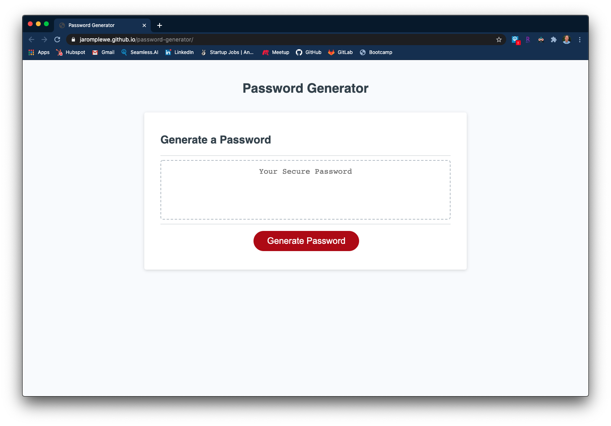

# Password Generator

**Link: https://jaromplewe.github.io/password-generator/**

### Description
Creating a strong password for business and personal accounts is a high importance for security. I've created a way to simply and automatically create your secure password. 
* Disclaimer: it is more important that your password has length than it matters which characters you use.

### Functionality

* User clicks on "generate password" button
* A prompt is given to ask how many characters the user would like the password to be.
* Followed by a series of confirmations depicting the character types the user would like to use.
* A password is displayed in the text box according to the criteria given by the user.